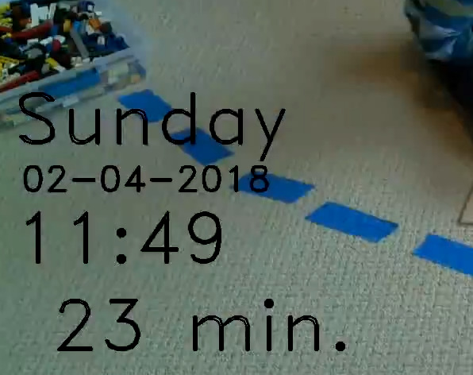

# raspberry-pi-timelapse
Notes and scripts for making timelapse sequences using my old Raspberry Pi 2 B.

# Raspberry Pi

I'm using a regular RaspiCam on an old RPi 2 B. The script `rpi/raspiCam_interval_timer.py` can be used to take pictures at regular intervals, as specified with the `-i` argument. Image are saved in the folder specified with the `-t` argument, and the program stops after `-n` images have been taken.

I usually ssh into the RPi, and then start a 5-hour picture taking session (1200 pictures, every 15 seconds):

```bash
nohup python /home/pi/bin/raspiCam_interval_timer_v2.py -i 15 -n 1200 -t /home/pi/timelapse/ &
```

Once my timelapse is done (usually well before 5 hours) I kill the process manually.

File names follows the convention "YYYY-MM-DD_hhmmss.jpg", e.g. `image_2021-11-19_170038.jpg`. This allows the subsequent script to load the images in the correct order, and to determine timing information for the timestamp overlay.


## Rsync to local computer

I regularly rsync the images currently on the RPi (usually in the `~/timelaps` folder) using rsync, e.g.:

```bash
IP_ADDRESS=my-local-pi-address
rsync -ahv pi@$IP_ADDRESS:timelapse ~/my_local/project_folder
```


# Combine images into video

Once all images are on my local computer, I use a Python script (`make_movie_cv2.py`) to combine the individual frames into a video clip. This uses the OpenCV library.

If wanted,  subsequent images can be blended together, which adds additional video frames. The `--blend`, or `-b` argument determines how many intermediate images will be produced between two original image frames.

A timestamp is shown when the `--ts` argument is present. The exact format and location of this text overlay can only be changed in the code at this point (in the "format_timestamp" function). Using the `--test` argument is useful while trying to find the right placement for the overlay. In test mode, no output file is saved. 

An example of a timestamp overlay is shown here:




## Help output for the movie making script

```bash
python make_movie_cv2.py -h
usage: make_movie_cv2.py [-h] [-o OUTPUT] [-v] [-t] [-b BLEND] [--fps FPS]
                         [--timestamp_format TIMESTAMP_FORMAT] [--ts]
                         imgpath
 
positional arguments:
  imgpath               Path to the image files
 
optional arguments:
  -h, --help            show this help message and exit
  -o OUTPUT, --output OUTPUT
                        Output file name (Default: output.mp4)
  -v, --view            View output
  -t, --test            Test run only. Do not create video.
  -b BLEND, --blend BLEND
                        Create (1 to 5) intermediate images between frames.
                        Default: 0 (off)
  --fps FPS             Frames per second (fps) for movie
  --timestamp_format TIMESTAMP_FORMAT
                        Time stamp format; default: "Y-m-d_HM"
  --ts                  Show timestamp
```


# OpenCV installation 4.5.5
Notes from an installation I did on my 2019 MacBook Pro on 2/1/2022. I'm using it within a Conda environment.

The computer needs to have XCode (and the command line tools) installed for this to work. 

## Conda environment

Create a conda enviroment that contains the tools I'll need (jupyter notebooks, etc):


```bash
mamba create -n opencv numpy scipy ipython notebook pandas
```


## Update dependencies

And make sure cmake, eigen3 and other dependencies are installed. (I'm using [MacPorts](https://www.macports.org/) for all these dependencies.)

```bash
sudo port selfupdate
sudo port upgrade outdated

sudo port install cmake
sudo port install eigen3
```

## Download OpenCV source

```bash
cd ~/code

git clone https://github.com/opencv/opencv.git
git clone https://github.com/opencv/opencv_contrib.git
```


## Create a build directory and run cmake from within it.

cmake will need information about Python paths. To find the paths, run these following two lines

```
#PYTHON3_LIBRARY: 
python -c "from distutils.sysconfig import get_python_inc; print(get_python_inc())"
# Output:
# /Users/armin/miniconda3/envs/opencv/include/python3.10

#PYTHON3_PACKAGES_PATH: 
python -c "from distutils.sysconfig import get_python_lib; print(get_python_lib())" 
# Output:
# /Users/armin/miniconda3/envs/opencv/lib/python3.10/site-packages
```

## Remove old OpenCV version

I noticed that there were a few files from an old OpenCV installation in `/usr/local`. Remove them to avoid conflicts:

```bash
sudo rm -rf /usr/local/include/opencv4
sudo rm /usr/local/lib/libopencv_*
```


## CMake 

Command used:

```bash
cd ~/code/opencv # The download folder for opencv
mkdir build
cd build

ENVPATH=/Users/armin/miniconda3/envs/opencv

cmake -D CMAKE_BUILD_TYPE=RELEASE \
-D CMAKE_INSTALL_PREFIX=/usr/local \
-D OPENCV_EXTRA_MODULES_PATH=/Users/armin/code/opencv_contrib/modules \
-D BUILD_opencv_python3=ON \
-D PYTHON3_LIBRARY=${ENVPATH}/include/python3.10 \
-D PYTHON3_INCLUDE_DIR=${ENVPATH}/include/python3.10 \
-D PYTHON3_EXECUTABLE=${ENVPATH}/bin/python \
-D PYTHON3_PACKAGES_PATH=${ENVPATH}/lib/python3.10/site-packages \
-D INSTALL_PYTHON_EXAMPLES=ON \
-D BUILD_opencv_python2=OFF \
-D OPENCV_ENABLE_NONFREE=ON \
-D BUILD_EXAMPLES=ON \
-D EIGEN_INCLUDE_PATH=/opt/local/include/eigen3 \
-D WITH_IPP=ON \
-D INSTALL_CREATE_DISTRIB=ON \
..

```

## Make

Run make, which takes a few minutes and hopefully completes without errors:

```
make -j12

# After it's done building:
sudo make install
```

## Test if it worked

### Python

Test if we can load cv2 module in iPython:

```python
import cv2                                                              

cv2.__version__                                                         
'4.5.5-dev'
```


## Logs

### Cmake output

```
--   OpenCV modules:
--     To be built:                 alphamat aruco barcode bgsegm bioinspired calib3d ccalib core datasets dnn dnn_objdetect dnn_superres dpm face features2d flann freetype fuzzy gapi hfs highgui img_hash imgcodecs imgproc intensity_transform line_descriptor mcc ml objdetect optflow phase_unwrapping photo plot python3 quality rapid reg rgbd saliency shape stereo stitching structured_light superres surface_matching text tracking video videoio videostab wechat_qrcode world xfeatures2d ximgproc xobjdetect xphoto
--     Disabled:                    -
--     Disabled by dependency:      -
--     Unavailable:                 cudaarithm cudabgsegm cudacodec cudafeatures2d cudafilters cudaimgproc cudalegacy cudaobjdetect cudaoptflow cudastereo cudawarping cudev cvv hdf java julia matlab ovis python2 sfm ts viz
--     Applications:                examples apps
--     Documentation:               NO
--     Non-free algorithms:         YES
-- 
--   GUI: 
--     Cocoa:                       YES
--     VTK support:                 NO
-- 
--   Media I/O: 
--     ZLib:                        build (ver 1.2.11)
--     JPEG:                        build-libjpeg-turbo (ver 2.1.2-62)
--     WEBP:                        build (ver encoder: 0x020f)
--     PNG:                         build (ver 1.6.37)
--     TIFF:                        build (ver 42 - 4.2.0)
--     JPEG 2000:                   build (ver 2.4.0)
--     OpenEXR:                     build (ver 2.3.0)
--     HDR:                         YES
--     SUNRASTER:                   YES
--     PXM:                         YES
--     PFM:                         YES
-- 
--   Video I/O:
--     DC1394:                      NO
--     FFMPEG:                      YES
--       avcodec:                   YES (58.134.100)
--       avformat:                  YES (58.76.100)
--       avutil:                    YES (56.70.100)
--       swscale:                   YES (5.9.100)
--       avresample:                YES (4.0.0)
--     GStreamer:                   NO
--     AVFoundation:                YES
-- 
--   Parallel framework:            GCD
-- 
--   Trace:                         YES (with Intel ITT)
-- 
--   Other third-party libraries:
--     Intel IPP:                   2020.0.0 Gold [2020.0.0]
--            at:                   /Users/armin/code/opencv/build/3rdparty/ippicv/ippicv_mac/icv
--     Intel IPP IW:                sources (2020.0.0)
--               at:                /Users/armin/code/opencv/build/3rdparty/ippicv/ippicv_mac/iw
--     Lapack:                      YES (/Applications/Xcode.app/Contents/Developer/Platforms/MacOSX.platform/Developer/SDKs/MacOSX12.1.sdk/System/Library/Frameworks/Accelerate.framework -lm -ldl)
--     Eigen:                       YES (ver 3.4.0)
--     Custom HAL:                  NO
--     Protobuf:                    build (3.19.1)
-- 
--   OpenCL:                        YES (no extra features)
--     Include path:                NO
--     Link libraries:              -framework OpenCL
-- 
--   Python 3:
--     Interpreter:                 /Users/armin/miniconda3/envs/opencv/bin/python (ver 3.10)
--     Libraries:                   /Users/armin/miniconda3/envs/opencv/include/python3.10 (ver 3.10.0)
--     numpy:                       /Users/armin/miniconda3/envs/opencv/lib/python3.10/site-packages/numpy/core/include (ver 1.21.2)
--     install path:                /Users/armin/miniconda3/envs/opencv/lib/python3.10/site-packages/cv2/python-3.10
-- 
--   Python (for build):            /opt/local/bin/python2.7
-- 
--   Java:                          
--     ant:                         NO
--     JNI:                         NO
--     Java wrappers:               NO
--     Java tests:                  NO
-- 
--   Install to:                    /usr/local
-- -----------------------------------------------------------------
-- 
-- Configuring done
-- Generating done
-- Build files have been written to: /Users/armin/code/opencv/build
```
